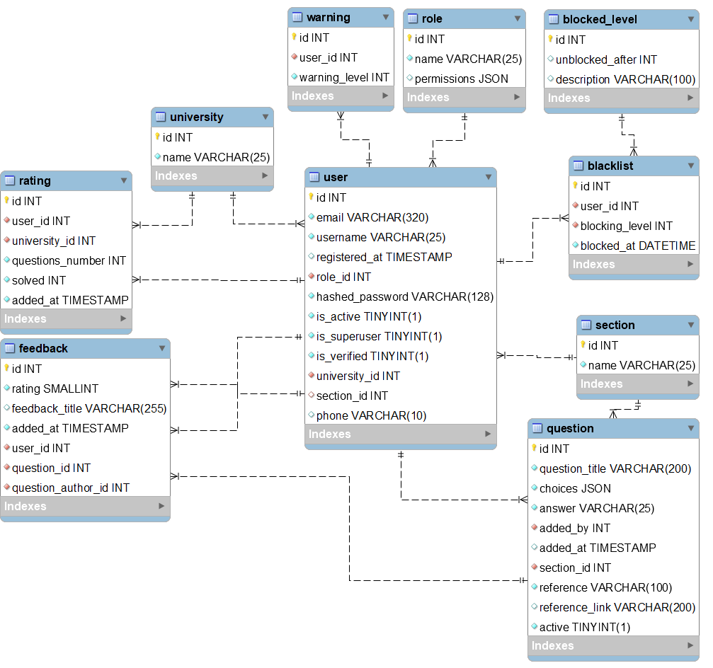
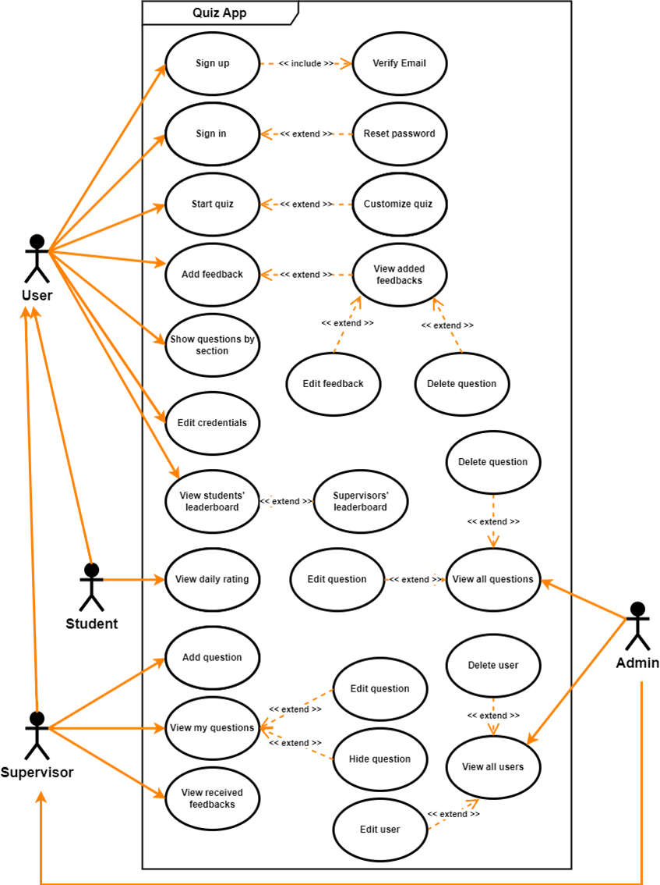
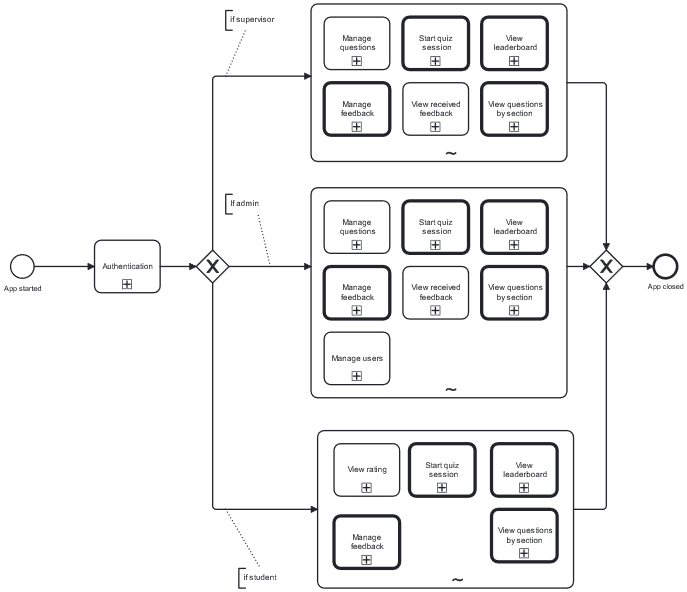
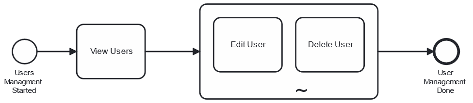
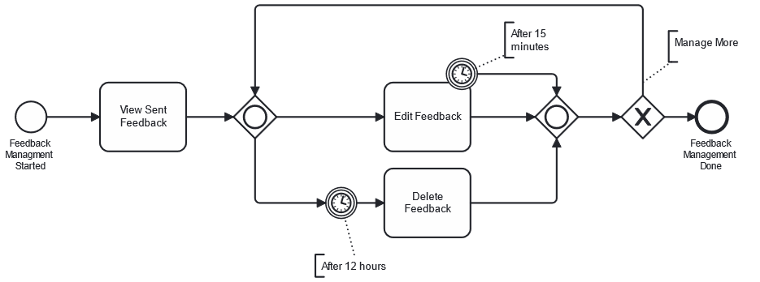
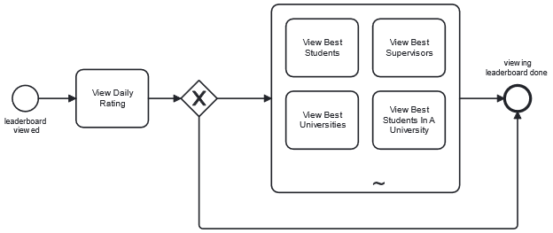
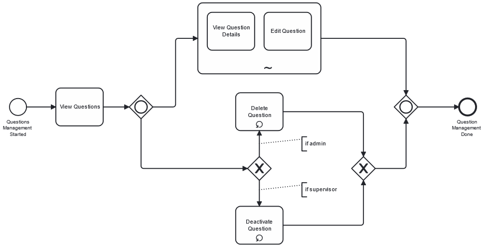
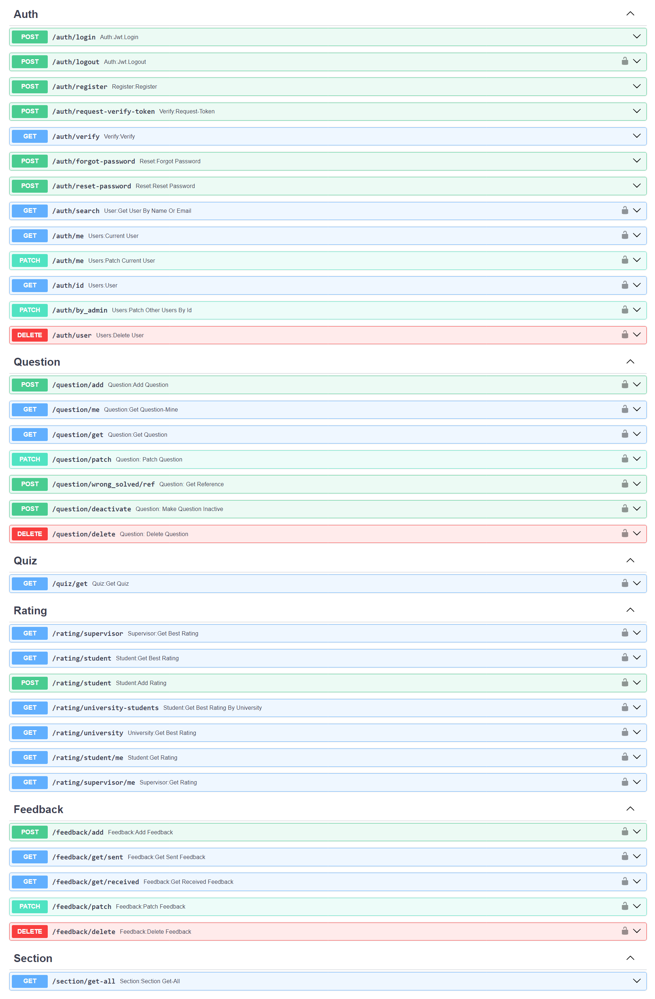

# Quiz API Project

Rest API project that helps students to prepare for the national exam.
<br/>

## Running on:

* Windows 11/10

* Python 3.11.4 or higher

* MySQL 8.0 or higher

## How to run

### Install from git:

```shell
$ git clone https://gitflic.ru/project/abstract-333/university-api
```

### Install dependencies:

```shell
$ pip install -r requirements.txt
```

### Make migration for database:

```shell
$ alembic init alembic
$ alembic upgrade head
```

### Run App:

```shell
$ cd src
$ uvicorn app:app --reload
```

## ERD:

* This project uses **MySQL**.
* A main **user** table.
* **Role** table that describes the main roles included in this rest api service.
* **Role** has should have three roles, **student**, **supervisor**(_teacher_) and **admin**.
* **User** can be admin when _is_superuser_ column is true.
* **Student** can't be _superuser_.
* **Section** describes how many sections could quiz have, such as IT speciality has three
  sections (Software Engineering, AI, Networks) or hom many sections as you consider is correct.
* **University** table just stores the name of universities.
* **User** has foreign keys from **university** and **section** tables, so every user should belong to university and
  specialized in specific section of the main study, whatever the user is student or supervisor.
* **Question** has questions that are entered by supervisors or admins, but every supervisor can only edit and delete
  own question.
* **Feedback** is provided by other users (**student**, **admin**, **supervisor**), note that user can't add feedback
  to own questions.
* **Rating** table stores the results of **student** in quizzes.
* **Blacklist** has users that intentionally solved many quizzes wrong in order of spamming or leveling down the
  university rank.
* **Blocked_level** describes many blocking levels that student can have.
* **Supervisor** didn't affect the rank of university, so when didn't mean to block him.
* _All_ **questions** couldn't be deleted, user can just prevent them from being used in quizzes, this step is import
  because we can monitor who has good effect on system (user can't delete questions so the effect of his questions will
  be visible forever).



## UML:
### _Note: If one of the images is not clear enough, please open it in new tab)_

### _Note: If one of the images is not clear enough, please open it in new tab)_

### 1. Use Case Diagram:



### 2. Business Process Model and Notation (BPMN):

* #### General BPMN of project



* #### Manage users - BPMN



* #### Manage Feedback - BPMN



* #### View Leaderboard - BPMN



* #### Manage Questions - BPMN



## Routers:

##### _Note that docs is auto generated by swagger api, there is also redoc documentation._

* **Swagger** documentation docs by url "http://127.0.0.1:8000/docs"
* **Redoc** documentation by url "http://127.0.0.1:8000/redoc"


